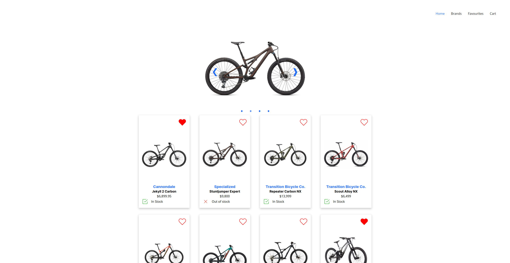
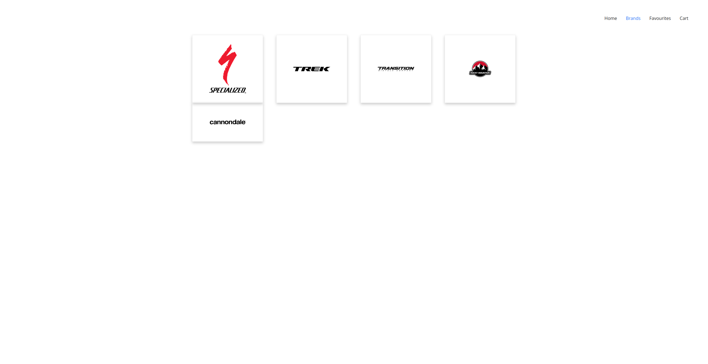
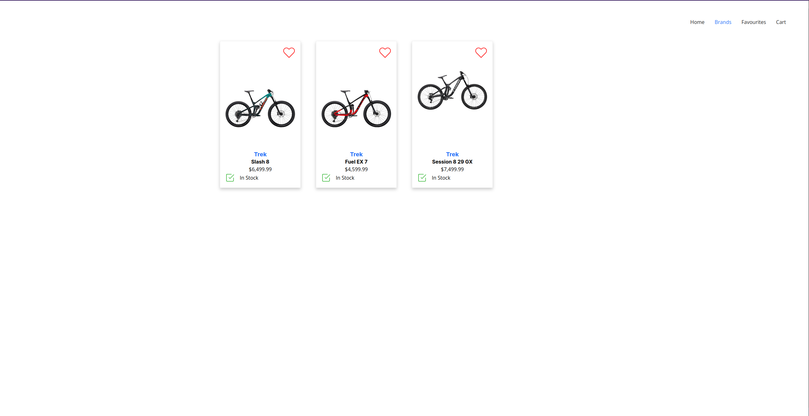
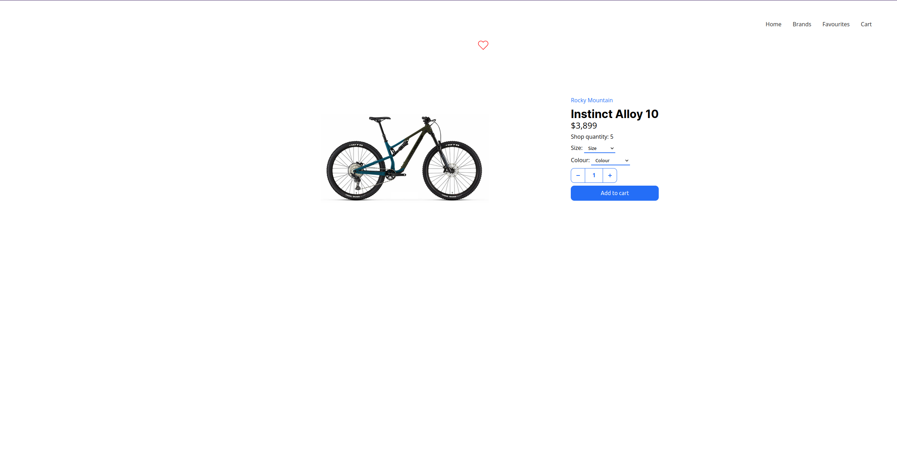
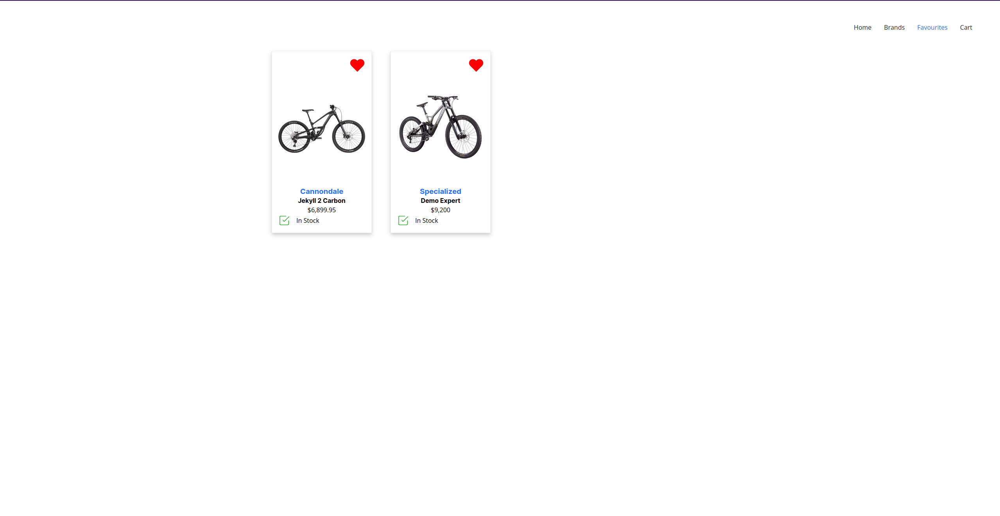
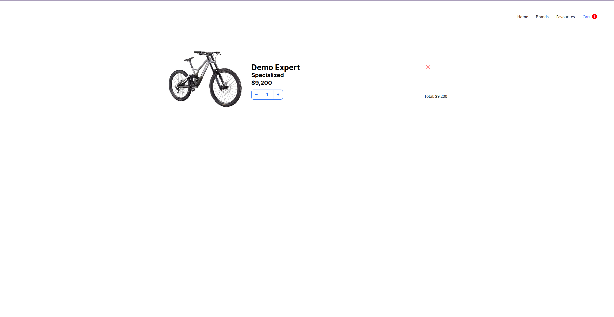
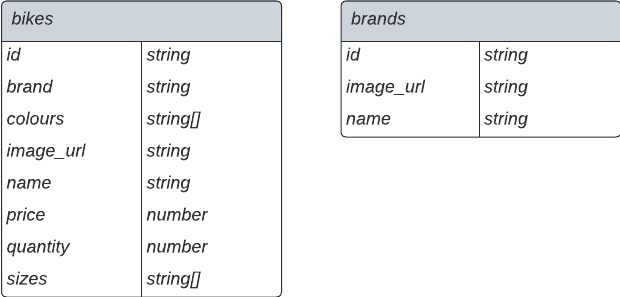

# E-commerce site

An e-commerce site using React for the frontend and Firestore for the cloud storage database. Although e-commerce sites have been done to death and this one in particular doesn't solve any real world problem, this is my rendition of one.

## Table of Contents

- [E-commerce site](#e-commerce-site)
  - [Table of Contents](#table-of-contents)
  - [Features](#features)
    - [Home Page](#home-page)
    - [Brands Page](#brands-page)
    - [Brand Page](#brand-page)
    - [Individual Shop Item Page](#individual-shop-item-page)
    - [Favourites Page](#favourites-page)
    - [Cart Page](#cart-page)
    - [Features I want to implement](#features-i-want-to-implement)
  - [Decisions](#decisions)
    - [Why I used Context](#why-i-used-context)
      - [Prop drilling](#prop-drilling)
      - [Reactivity and Local Storage](#reactivity-and-local-storage)
      - [Drawbacks](#drawbacks)
    - [Why I used prop-types and JSDocs](#why-i-used-prop-types-and-jsdocs)
  - [Database Model](#database-model)

## Features

### Home Page

- Image carousel with clickable items that route to their own page.
- Every item in the shop is displayed on a card.
- Each card is able to:

  - Make the item favouritable.
  - Display the item.
  - Show if the item is in stock or not.
  - Have the brand name clicked and be routed to the brand's page that just displays that specific brand's items.
  - Show the name of the item.
  - Display the price of the item.
  - Be clicked on and be routed to display more info of that specific item.

### Brands Page

Page is pretty simple, this page lists all of the brands of the items with clickable cards.

### Brand Page

Page is very similar to the [home page](#home-page) in terms of functionality, only difference is that it only displays the items related to that specific brand.

### Individual Shop Item Page

This page is for displaying a specific item in the shop. It is basically an extension to the card. The user is able to select a size, colour, quantity and add the item to the cart. if the user does not select a size and or a colour, the UI will let the user know. How the item is added to the cart and store will be discussed [further down](#why-i-used-context).

### Favourites Page

Page is very simple as it does what it says, yet it is some what complicated due to the fact that there are no user accounts to make the favourites easily unique and I wanted the favourites to persist, I discuss my solution and reason [further down](#why-i-used-context).

### Cart Page

This page was a bit more technically difficult than I thought it would be initially, as I wanted the cart to persist when the user comes back to the site. I discuss how I solved it [further down](#why-i-used-context). There are a few more features I would like to add to this page, which are listed [below](#features-i-want-to-implement).

The cart's features are quite swish:

- A notification shows on the cart in the navigation bar if there is an item in the cart with the total amount of items in the cart.
- A quantity is is shown with the price and if the user changes the quantity, so does the total price.
- User is able to remove the item from the cart entirely.

### Features I want to implement

- [ ] On initial page load, load the items into a context to avoid contstant re-fetching from the database.
- [ ] Display different coloured items depending on the colour selected.
- [ ] Have a description of the item.
- [ ] Implement a sizing guide.
- [ ] Ability to change the colour / size of the item from the shopping cart.
- [ ] Tally the entire cart.
- [ ] Display the total number of items favourited.
- [ ] User cannot add a higher quantity than the amount in stock.

## Decisions

### Why I used Context

There is a lot to this, so buckle up.

#### Prop drilling

One of the main reasons why I used React's Context API was to remove the amount of props that are being drilled down the component tree. I chose to do this quite early because I knew it was going to become a problem with the Cart Context and Favourites Context. Keeping track of props is hard, especially when using JavaScript and not TypeScript, I used Meta's `prop-types` Node.js package to mitigate this issue but I knew it was going to be too hard to keep track of an item and it's data, if the item is favourited and if the item is in the cart all at once and passing it around and down the tree.

#### Reactivity and Local Storage

I would make these two topics separate but they kinda go hand it hand for my use case. Local Storage was _in my opinion_ the best way I could keep the cart and favourites separate per user without creating user accounts.

I created `cart` and `favourites` arrays in the Local Storage. The favourites array only stores an array of strings which are the item's id. The favourites array is an array of objects that contains the item's id and the quantity that is selected. On page load, the context's do their thing, fetch the items from the database by ids and store them into state. This is my solution to simulate if a user was logged in and adding items to their personal cart and favourites and make it reactive. If there is a more simplified way and or better solution, please let me know.

#### Drawbacks

React's Context API is a godsend when it comes to passing data around. There are a few drawbacks though, especially when the Context API is not used properely. Passing data around that updates **a lot** massively slows down the app, I had to carefully curate how I was going to design the cart and favourite context to keep performance.

I believe context was a good solution for this use case as data isn't going to be updated very often, I could've used a global state manager to make this even more simple like [Redux](https://redux.js.org/) or [Zustand](https://zustand-demo.pmnd.rs/) but I believe that there wasn't enough data being passed around to take advantage of such tool.

### Why I used prop-types and JSDocs

**I needed a better development expereience** since I am not using TypeScript ~~although, I should be~~, I needed a way to make sure I was going to be passing the correct props and their correct types into components as well as a big error if I was doing something wroong. JavaScript quickly becomes a nightmare with this as you get **absolutely nothing** back if you are doing something that you shouldn't be. JSDocs is another way to make my development experience a bit nicer, I can simulate type definitions and return types of functions, components and props, although it doesn't _really_ work and I don't get better errors and things like that, it makes VS Code's intellisense a bit more intelligent.

## Database Model

This is my very simple solution using a document database. If I were to use a relational database, I would make a one-to-many relationship to the brand name in the `brands` table, this would make the database querying a lot easier, type-safe and faster.

I also wished I named the documents without a plural, I couldn't work out how to rename the documents without deleting the entire document, but by then I had filled the documents completely.

